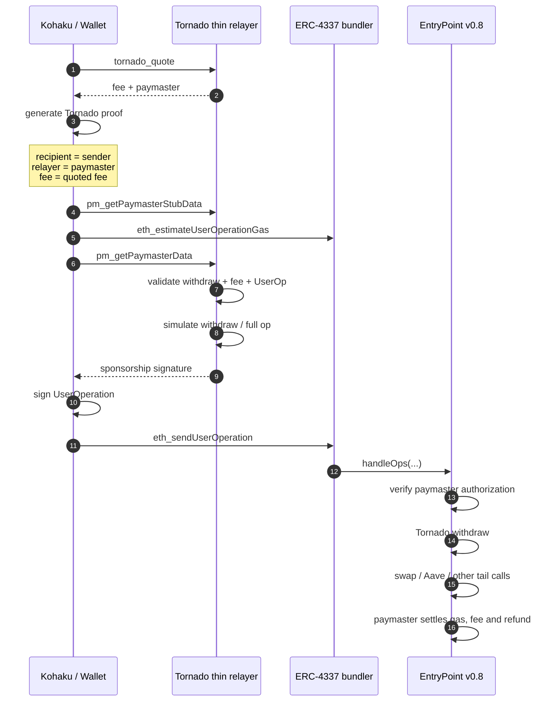

# tornado-4337-relayer

**A thin Tornado Cash sponsorship layer for atomic ERC-4337 withdrawals.**

English | [简体中文](#简体中文)

This project demonstrates how the existing Tornado Cash relayer model can support ERC-4337 atomic flows **without modifying existing Tornado pool contracts and without requiring Tornado relayers to become bundlers**.

The relayer stays intentionally thin:

- quote the Tornado withdrawal fee;
- validate the withdrawal and UserOperation off-chain;
- sign sponsorship terms for a verifying paymaster.

The wallet then submits the sponsored UserOperation to a standard ERC-4337 bundler.

This enables flows such as:

```text
Tornado withdraw → swap → Aave supply
```

inside **one atomic UserOperation**.

> **Status:** working PoC with Kohaku SDK integration, mainnet-fork E2E tests, and a live Sepolia run.  
> **Warning:** experimental software, not audited and not production-ready.

---

## Why

A traditional Tornado Cash relayer has a narrow, application-specific role:

```text
user → Tornado relayer → Tornado pool
```

ERC-4337 makes atomic post-withdrawal actions possible today, but sponsorship and transaction inclusion do not need to be handled by the same entity.

This project separates those responsibilities:

```text
                         ┌────────────────────────┐
User / Kohaku ──────────→│ Tornado thin relayer  │
                         │ quote / check / sign   │
                         └───────────┬────────────┘
                                     │ sponsorship
                                     ▼
                         ┌────────────────────────┐
                         │ Verifying Paymaster    │
                         └────────────────────────┘

User / Kohaku
      │
      │ sponsored UserOperation
      ▼
Generic ERC-4337 bundler
      │
      ▼
EntryPoint
      │
      ▼
withdraw → arbitrary atomic actions
```

The Tornado-specific logic remains with the relayer.

Bundling remains generic infrastructure.

---

## What this demonstrates

### Existing Tornado pools stay unchanged

The withdrawal still executes against the existing Tornado pool contract.

The zk proof binds the usual public inputs:

```text
recipient
relayer
fee
```

In this design:

```text
relayer = TornadoRelayerPaymaster
```

so the existing pool pays the relayer fee directly to the paymaster during execution.

No change to the Tornado pool contracts or proving circuit is required.

### The relayer does not become a bundler

The relayer never submits the Ethereum transaction.

It only:

```text
quote
→ validate
→ simulate
→ sign sponsorship
→ return authorization
```

The wallet can submit the resulting UserOperation to any compatible ERC-4337 bundler.

### Sponsorship remains Tornado-specific

The relayer can keep the same kind of application-specific policy Tornado relayers already have:

- supported pools;
- fee policy;
- proof / root / nullifier validation;
- gas pricing;
- service fees;
- privacy policy;
- Tor or other private transport.

### Atomic post-withdrawal actions

Because the withdrawal and following calls execute from the same ERC-4337 account, arbitrary actions can be composed atomically.

For example:

```text
withdraw ETH
→ wrap ETH
→ swap
→ supply to Aave
```

or:

```text
withdraw
→ swap
→ transfer
```

If the atomic execution reverts, the Tornado withdrawal reverts with it as part of the same UserOperation.

---

## Architecture



---

## Packages

| Path | Purpose |
| --- | --- |
| `contracts/` | `TornadoRelayerPaymaster.sol` and `SwapAndSupplyZap.sol` |
| `contracts-tornado/` | Upstream Tornado contracts compiled separately for fork testing |
| `relayer/` | Thin ERC-7677-compatible sponsorship service |
| `client/` | Reference client, proof generation, state sync and E2E harness |
| `kohaku-integration/` | Kohaku SDK patch, example host and E2E integration |

---

## Paymaster

`TornadoRelayerPaymaster` is a verifying ERC-4337 paymaster.

During validation it checks the relayer's signature over the UserOperation and fee terms.

During execution:

```text
Tornado pool
    │
    ├─ denomination - fee → sender
    └─ fee → paymaster
```

After execution, `postOp`:

1. calculates the actual gas cost;
2. keeps gas cost + configured margin + service fee;
3. refunds the unused part of the quoted fee;
4. re-deposits retained ETH into EntryPoint.

For ERC-20 Tornado pools, fees are paid in the pool token and priced off-chain by the relayer.

The current `paymasterAndData` layout is:

```text
paymaster(20)
| paymasterVerificationGasLimit(16)
| paymasterPostOpGasLimit(16)
| validUntil(6)
| validAfter(6)
| fee(32)
| serviceFee(32)
| refundTo(20)
| feeToken(20)
| tokenPerEth(32)
| signature(65)
```

---

## Thin relayer

The relayer exposes:

```text
tornado_quote
pm_getPaymasterStubData
pm_getPaymasterData
tornado_status
```

The relayer holds only its sponsorship signing key.

It does **not**:

- custody user funds;
- receive the user's ephemeral sender private key;
- submit bundles;
- operate a UserOperation mempool;
- need to be the bundler.

The wallet remains responsible for choosing a bundler and broadcasting the sponsored UserOperation.

### Sponsorship flow

`pm_getPaymasterData`:

1. decodes the account calls;
2. finds the sponsored Tornado withdrawal;
3. checks that `relayer == paymaster`;
4. verifies that the quoted fee covers the actual UserOperation gas limits;
5. rejects simultaneous sponsorship of the same nullifier;
6. simulates the Tornado withdrawal;
7. optionally asks the bundler to estimate the full UserOperation;
8. signs the sponsorship terms with a short validity window.

---

## Kohaku integration

Kohaku already has a `mode: 'paymaster'` unshield path backed by the trustless PrivacyPaymaster.

This repository adds a second sponsorship model behind the same API, selected per chain by config:

```text
trustless PrivacyPaymaster        (Kohaku default)
Tornado relayer-signed Paymaster  (this project)
```

The integration reuses Kohaku's existing:

- EIP-7702 ephemeral sender;
- Tornado proof generation;
- account execution;
- broadcaster;
- tail-call support.

The main host-side addition is a relayer endpoint:

```ts
const paymasterConfig = {
  [chainId]: {
    bundlerUrl: 'https://public.pimlico.io/v2/11155111/rpc',
    entryPointAddress: '0x4337084D9E255Ff0702461CF8895CE9E3b5Ff108',
    paymasterAddress: '<TornadoRelayerPaymaster>',
    poolsAccountsMap: {},
    relayer: { url: 'https://relayer.example/' },
  },
};
```

Any viem / permissionless wallet can also use the relayer as an ERC-7677 paymaster client.

---

## Run locally

Requirements:

- Foundry
- Node.js >= 22
- pnpm

Install and test:

```bash
pnpm install

(cd contracts && forge install && forge build && forge test)
(cd contracts-tornado && forge build)

pnpm --filter @tornado-4337/relayer test
```

Run the full mainnet-fork flow:

```bash
MAINNET_RPC_URL=https://ethereum-rpc.publicnode.com \
  pnpm --filter @tornado-4337/client e2e
```

The harness uses:

- EntryPoint v0.8;
- `Simple7702Account`;
- Uniswap V3;
- Aave V3;
- a fresh Tornado ETH instance bound to the real Groth16 verifier;
- an ERC-4337 bundler;
- the thin relayer.

If `TORNADO_ARTIFACTS_DIR` is not set, the client downloads the Tornado circuit artifacts once into `client/artifacts/`.

---

## Kohaku SDK E2E

```bash
pnpm --filter @tornado-4337/kohaku-integration setup
pnpm --filter @tornado-4337/kohaku-integration e2e
```

The test:

- clones Kohaku at a pinned commit;
- applies the relayer-signed paymaster patch;
- shields through the real Kohaku SDK;
- unshields through the relayer / paymaster path;
- performs atomic tail calls.

---

## Run on Sepolia

You need:

- an owner key;
- a relayer signer key;
- a user key;
- enough Sepolia ETH for deployment, paymaster deposit, a note and gas.

### 1. Deploy contracts

```bash
cd contracts

PRIVATE_KEY=0x<owner> \
RELAYER_SIGNER=0x<relayer address> \
DEPOSIT_WEI=50000000000000000 \
DEPLOY_ZAP=true \
WETH=0xC558DBdd856501FCd9aaF1E62eae57A9F0629a3c \
SWAP_ROUTER=0x3bFA4769FB09eefC5a80d6E87c3B9C650f7Ae48E \
AAVE_POOL=0x6Ae43d3271ff6888e7Fc43Fd7321a503ff738951 \
forge script script/Deploy.s.sol \
  --rpc-url https://sepolia.gateway.tenderly.co \
  --broadcast
```

### 2. Run the relayer

```bash
cd relayer

cat > .env <<EOF
CHAIN_ID=11155111
RPC_URL=https://sepolia.gateway.tenderly.co
BUNDLER_URL=https://public.pimlico.io/v2/11155111/rpc
PAYMASTER_ADDRESS=0x<paymaster>
RELAYER_PRIVATE_KEY=0x<relayer>
TORNADO_INSTANCES=0x8C4A04d872a6C1BE37964A21ba3a138525dFF50b,0x8cc930096B4Df705A007c4A039BDFA1320Ed2508,0x6921fd1a97441dd603a997ED6DDF388658daf754
PRICE_SOURCE=fixed
FIXED_TOKENS_PER_ETH=0xFF34B3d4Aee8ddCd6F9AFFFB6Fe49bD371b8a357:3000
EOF

pnpm start
```

### 3. Shield and withdraw

```bash
cd client

PRIVATE_KEY=0x<user> \
  pnpm sepolia deposit

PRIVATE_KEY=0x<user> \
ZAP=0x<zap> \
  pnpm sepolia withdraw tornado-eth-0.1-11155111-0x...
```

---

## Live Sepolia run

A live end-to-end flow has been executed with the patched Kohaku CLI, the relayer-signed paymaster, and Pimlico's public Sepolia bundler.

| Item | Value |
| --- | --- |
| `TornadoRelayerPaymaster` | `0xA05e12016882b2FE01A080b04F5D2F6FC3AC6E94` |
| `SwapAndSupplyZap` | `0x2B247C8ee4556B35d510C0BdBD75194c11C4Ca33` |
| Kohaku shield 0.1 ETH | `0x14c3daaa20829573465c0c5a96b6eb5fbcbae42a114b8dfedf9c93c5496e73ac` |
| Kohaku unshield + atomic Aave tail call | `0x5d61d705186b06381a29c23a272c7aba92a15b2cb6012c8548105524b41b7000` |
| `userOpHash` | `0xf93449c59b5a5e16414b5e6be79d45ea9840f2b4118a3ffdc6b89e75a2a5e46d` |

Sepolia Etherscan:

- Paymaster: https://sepolia.etherscan.io/address/0xA05e12016882b2FE01A080b04F5D2F6FC3AC6E94
- Zap: https://sepolia.etherscan.io/address/0x2B247C8ee4556B35d510C0BdBD75194c11C4Ca33
- Shield tx: https://sepolia.etherscan.io/tx/0x14c3daaa20829573465c0c5a96b6eb5fbcbae42a114b8dfedf9c93c5496e73ac
- Atomic unshield tx: https://sepolia.etherscan.io/tx/0x5d61d705186b06381a29c23a272c7aba92a15b2cb6012c8548105524b41b7000

Observed live result:

```text
fee bound in proof : 0.002380 ETH
actual gas         : 0.000930 ETH
refund             : 0.001033 ETH
wallet receives    : 0.097620 aWETH
paymaster deposit  : 0.05 → 0.050417 ETH
```

Pimlico is used only for this live demo. The architecture is not tied to a specific bundler.

---

## Economics

Example E2E results at roughly 1.1 gwei:

| | 0.1 ETH note, mainnet fork | 100 DAI note, mainnet fork | 0.1 ETH note, Sepolia fork |
| --- | ---: | ---: | ---: |
| Flow | swap + Aave | Aave | Kohaku + Aave |
| Fee bound in proof | 0.001604 ETH | 3.09 DAI | 0.001445 ETH |
| Actual gas cost | 0.000907 ETH | 0.000755 ETH | — |
| Refund to user | 0.000253 ETH | 0.57 DAI | 0.000228 ETH |
| Paymaster keeps | +0.000385 ETH net | 2.52 DAI for ~0.0008 ETH gas | — |
| Landed on user | 246.96 aUSDC | 96.91 aDAI | 0.098555 aWETH |

Over-quoting is intentionally conservative: the unused part is refunded on-chain.

---

## Trust and censorship model

This design does **not** make ERC-4337 censorship-resistant.

There are two independent decisions:

```text
Tornado relayer:
"Will I sponsor this UserOperation?"

Bundler:
"Will I accept and include this UserOperation?"
```

A relayer can refuse sponsorship.

A bundler can refuse Tornado or other privacy-related UserOperations.

The wallet therefore does not need to use the same infrastructure for sponsorship and inclusion:

```text
User
  ↓
Tornado relayer
  ← sponsorship authorization

User
  ↓
chosen ERC-4337 bundler
```

Production clients should support multiple bundlers and privacy-preserving transport where possible.

---

## Relation to EIP-8141

This project demonstrates the ERC-4337 path that is available **today**.

It is not a claim that ERC-4337 should be the final account-abstraction architecture for Tornado Cash.

The Tornado-specific part is intentionally kept thin:

```text
fee quoting
withdrawal validation
sponsorship policy
privacy policy
```

These responsibilities can survive a future migration to native account abstraction.

With an EIP-8141-style architecture, the long-term flow could become substantially simpler:

```text
User
  ↓
Tornado sponsor
  ← sponsorship

User
  ↓
FrameTx
  ↓
normal Ethereum mempool
```

The UserOperation / bundler / EntryPoint layer would no longer be necessary.

For that reason, this project deliberately avoids putting Tornado-specific business logic into the bundler layer.

---

## Current limitations

- Experimental software; not audited.
- The live demo currently uses a third-party ERC-4337 bundler.
- Bundler censorship remains possible.
- A sponsored UserOperation that reverts still costs the paymaster gas.
- ERC-20 fees must eventually be converted back to ETH to replenish the EntryPoint deposit.
- The current nullifier sponsorship lock is in-memory and is not suitable for horizontally scaled production relayers.
- Mainnet USDC / USDT Tornado pools remain affected by issuer-level token freezes.
- ERC-20 fee conversion should be handled by a keeper or operator process, not inside `postOp`.

---

# 简体中文

**面向 ERC-4337 原子化提现的轻量 Tornado Cash sponsorship 层。**

这个项目演示了一种在 **不修改现有 Tornado pool 合约，也不要求 Tornado relayer 变成 bundler** 的前提下，为现有 Tornado relayer 模型增加 ERC-4337 原子操作能力的方法。

relayer 的职责保持很薄：

- 对 Tornado withdrawal 报价；
- 在链下检查 withdrawal 和 UserOperation；
- 为 verifying paymaster 签署 sponsorship 授权。

钱包随后可以自行选择标准 ERC-4337 bundler，将已经获得 sponsorship 的 UserOperation 发送出去。

因此可以在一个 **atomic UserOperation** 中完成：

```text
Tornado withdraw → swap → Aave supply
```

> **状态：** 已完成 working PoC、Kohaku SDK 集成、mainnet fork E2E，以及 Sepolia 实网测试。  
> **注意：** 尚未审计，不适合直接用于生产环境。

---

## 为什么做这个

传统 Tornado Cash relayer 的工作非常专一：

```text
用户 → Tornado relayer → Tornado pool
```

ERC-4337 今天已经可以实现 withdrawal 后的原子操作，但 sponsorship 和交易 inclusion 没必要由同一个实体负责。

这个项目把两个角色拆开：

```text
用户 / Kohaku
      │
      ▼
Tornado thin relayer
报价 / 检查 / 签名
      │
      ▼
Verifying Paymaster

用户 / Kohaku
      │
      │ 已获得 sponsorship 的 UserOperation
      ▼
通用 ERC-4337 bundler
      │
      ▼
EntryPoint
      │
      ▼
withdraw → 任意 atomic actions
```

Tornado-specific 的业务逻辑仍然留在 relayer。

Bundling 则继续作为通用 Ethereum AA 基础设施。

---

## 这个项目证明了什么

### 不需要修改现有 Tornado pool

withdrawal 仍然直接调用现有 Tornado pool。

zk proof 和原来一样绑定：

```text
recipient
relayer
fee
```

在这个设计中：

```text
relayer = TornadoRelayerPaymaster
```

所以现有 pool 在执行 withdrawal 时，会直接把原本支付给 relayer 的手续费支付给 paymaster。

不需要修改 Tornado pool 合约，也不需要修改 zk circuit。

### Relayer 不需要成为 bundler

relayer 不负责提交 Ethereum transaction。

它只负责：

```text
报价
→ 校验
→ 模拟
→ 签署 sponsorship
→ 把授权返回给用户
```

之后用户可以把完整 UserOperation 提交给任意兼容的 ERC-4337 bundler。

### Tornado-specific sponsorship 仍由 relayer 决定

现有 relayer 仍然可以独立决定：

- 支持哪些 pools；
- fee；
- proof / root / nullifier 检查；
- gas pricing；
- service fee；
- privacy policy；
- 是否支持 Tor / private transport。

### 支持任意原子化后续操作

由于 withdrawal 与后续调用由同一个 ERC-4337 account 执行，可以实现：

```text
withdraw ETH
→ wrap
→ swap
→ Aave supply
```

或者：

```text
withdraw
→ swap
→ transfer
```

如果后面的 atomic flow 失败，前面的 withdrawal 也会一起 revert。

---

## 架构

```text
用户 / Kohaku
      ↓
Tornado thin relayer
      ↓
检查 withdrawal / fee / UserOp
      ↓
返回 paymaster sponsorship signature

用户 / Kohaku
      ↓
自行选择 ERC-4337 bundler
      ↓
EntryPoint
      ↓
Tornado withdraw
      ↓
swap / Aave / arbitrary tail calls
      ↓
paymaster 结算 gas / fee / refund
```

---

## Paymaster

`TornadoRelayerPaymaster` 是一个 verifying ERC-4337 paymaster。

validation 阶段只检查 relayer 对 UserOperation 和 fee terms 的签名。

执行 withdrawal 时：

```text
Tornado pool
    │
    ├─ denomination - fee → sender
    └─ fee → paymaster
```

执行结束后，`postOp`：

1. 计算实际 gas cost；
2. 保留 gas cost + margin + service fee；
3. 把多收的部分退款给用户；
4. ETH fee 自动重新 deposit 到 EntryPoint。

对于 ERC-20 Tornado pools，手续费使用 pool token 支付，由 relayer 在链下进行 ETH/token 定价。

---

## Thin relayer

relayer 提供：

```text
tornado_quote
pm_getPaymasterStubData
pm_getPaymasterData
tornado_status
```

relayer 只持有 sponsorship signing key。

它不会：

- 托管用户资金；
- 获得用户 ephemeral sender private key；
- 自己提交 bundle；
- 维护 UserOp mempool；
- 必须充当 bundler。

bundler 的选择和 UserOperation 广播仍由 wallet/client 控制。

---

## Kohaku 集成

Kohaku 本身已经存在基于 trustless PrivacyPaymaster 的 `mode: 'paymaster'` unshield path。

这个项目在同一套 API 下增加了第二种 sponsorship 模式，按链配置选择：

```text
trustless PrivacyPaymaster        （Kohaku 默认）
Tornado relayer-signed Paymaster  （本项目）
```

仍然复用 Kohaku 原本的：

- EIP-7702 ephemeral sender；
- Tornado proof generation；
- account execution；
- broadcaster；
- tail calls。

host 侧只需要在原有 paymaster/bundler 配置上增加一个 relayer endpoint。

---

## Trust 与 censorship

这个设计 **并没有解决 ERC-4337 的 censorship 问题**。

实际上存在两个独立决定：

```text
Tornado relayer:
“我愿不愿意 sponsor 这笔 UserOperation？”

Bundler:
“我愿不愿意 include 这笔 UserOperation？”
```

relayer 可以拒绝 sponsorship。

bundler 也可以拒绝 Tornado / privacy-related UserOperation。

因此 sponsorship 和 inclusion 没有必要绑定在一起：

```text
用户
 ↓
Tornado relayer
 ← sponsorship authorization

用户
 ↓
自己选择的 ERC-4337 bundler
```

生产环境客户端应该支持多个 bundler，并尽量支持 Tor 或其他 privacy-preserving transport。

---

## 与 EIP-8141 的关系

这个项目实现的是 **今天已经可以使用的 ERC-4337 路径**。

它并不意味着 ERC-4337 应该成为 Tornado Cash 最终的 AA 架构。

真正 Tornado-specific、值得长期保留的是：

```text
fee quoting
withdrawal validation
sponsorship policy
privacy policy
```

如果未来 Ethereum 部署 EIP-8141 一类 native AA，这些逻辑仍然可以保留，而：

```text
UserOperation
bundler
EntryPoint
```

这一层则可以由 native FrameTx 取代。

长期流程可能变成：

```text
用户
 ↓
Tornado sponsor
 ← sponsorship

用户
 ↓
FrameTx
 ↓
Ethereum normal mempool
```

因此这个项目刻意没有把 Tornado-specific business logic 放进 bundler 层。

---

## 当前限制

- 实验性软件，尚未审计。
- 当前 live demo 使用第三方 ERC-4337 bundler。
- bundler censorship 仍然存在。
- UserOperation revert 时，paymaster 仍然要承担 gas。
- ERC-20 fee 需要最终转换为 ETH，以补充 EntryPoint deposit。
- 当前 nullifier sponsorship lock 只保存在内存中，不适合直接用于水平扩展的生产 relayer。
- Mainnet USDC / USDT Tornado pools 仍然受 token issuer freeze 影响。
